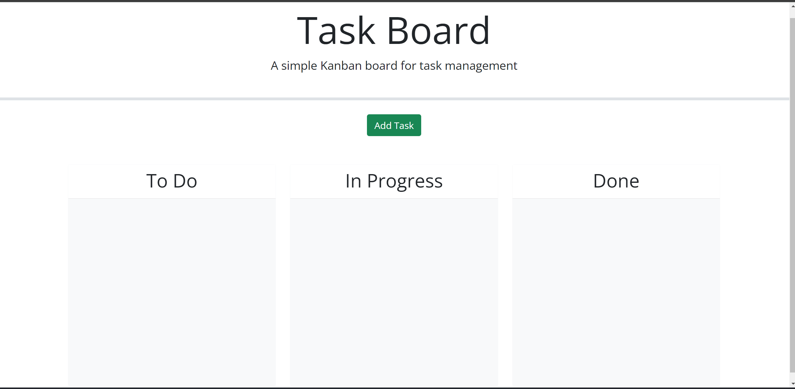
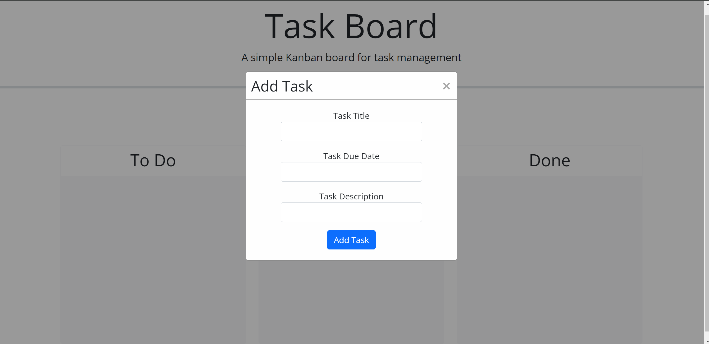
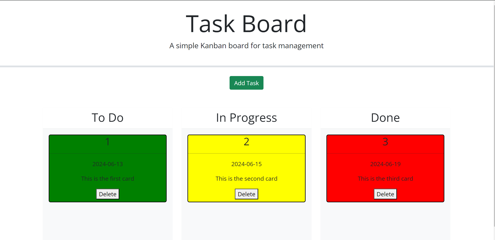

# Kanban-5

Description: This repo was created to showcase a site where you can create personal task cards to track things you are trying to do.

Installation: N/A

Usage: To use this repo, examine the code in the javascript file to see how to create html elements, save them to local storage, and use the jquery drag and drop actions.

Link to site: https://stringer-j.github.io/Kanban-5/

Credits: N/A

License: Refer to the LICENSE in the repo.

This was made with extensive use of the Xpert Learning assistant and information from the furthest reaches of the internet.